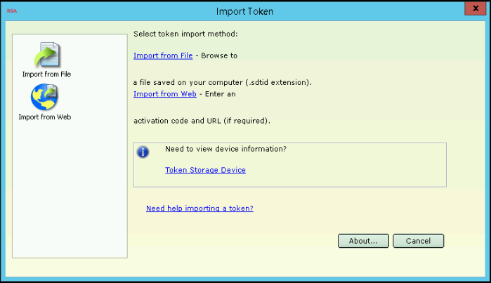

[](https://opensource.org/licenses/MIT)

What is this for?
=================

If you need to use an [RSA SecurID](//en.wikipedia.org/wiki/RSA_SecurID) software token
to generate [one-time passwords](//en.wikipedia.org/wiki/One-time_password), and
have been given an activation code and a URL like
`https://XXX.com:443/ctkip/services/CtkipService`, this software will allow you to
provision the token and save it in a format that you can use with
[stoken](//github.com/cernekee/stoken).

If you use the RSA's official software (RSA SecurID) to provision the
token, it will obscure the token seed to prevent you from copying it
to another computer:



Requirements
============

Client needs Python **3.x**, PyCryptoDome, and requests (which will be automatically installed with `pip`). [stoken](//github.com/cernekee/stoken) is needed to save the resulting tokens in a usable format. Running the [fake server](#fake-server) requires Flask as well.

Install with `pip3` to automatically fetch Python dependencies. (Note that on most systems, `pip` invokes the Python 2.x version, while `pip3` invokes the Python 3.x version.)

```
# Install latest development version
$ pip3 install https://github.com/dlenski/rsa_ct_kip/archive/HEAD.zip

# Install a tagged release
# (replace "RELEASE" with one of the tag/release version numbers on the "Releases" page)
$ pip3 install https://github.com/dlenski/rsa_ct_kip/archive/v0.3.zip
```

Provision token using client
============================

Provide the client with the activation URL and activation code
(usually 12 digits), and a file in which to save the token template.
It will communicate with the RSA CT-KIP server and provision a token,
then attempt to call `stoken` to convert the token to XML/.sdtid format:

```
$ rsa_ct_kip https://server.company.com:443/ctkip/services/CtkipService ACTIVATION_CODE template.xml
Sending ClientHello request to server...
Received ServerHello response with server nonce (R_S = 28198dbe2c18a00335179cc5bb4eff3a) and 1024-bit RSA public key
Generated client nonce (R_C = 12bec1a6f4d09470986b485561c4d2b5)
Sending ServerFinished request to server, with encrypted client nonce...
MAC verified (0f103bc63a8819ffdbee657d042144f6)
Received ServerFinished response with token information:
  Service ID: RSA CT-KIP
  Key ID: 838999658504
  Token ID: 838999658504
  Token User:
  Expiration date: 2020-01-23T00:00:00+00:00
  OTP mode: 8 Decimal, every 60 seconds
  Token seed: 30ade1be20b3867d967bd2927c8eb0ca
Saved token in XML/.sdtid format to /tmp/test.sdtid
```

If `stoken` is not installed in your path, or fails to execute
successfully, then a template file will be left behind instead.
Convert the template output to an RSA SecurID token in XML format with
a working copy of `stoken`, as instructed:

```
$ stoken export --random --sdtid --template=template.xml > 838999658504.sdtid
```

Fake server
===========

The server (invoked with `python3 -m rsa_ct_kip.fakeserver`) mimics a "real" RSA CT-KIP server and can
be used for interoperability testing with a "real" RSA SecurID client.
It accepts the requests sent by the client software at two different
paths: `/` for laziness, and `/ctkip/services/CtkipService`
in case any real client hard-codes this path.

It provisions tokens with randomly-generated 12-digit IDs, which it does
not retain. Official RSA SecurID clients for Windows and Android have
been verified to connect to it, and provision tokens from its output.

The server can run either via HTTP or HTTPS. For HTTPS, create a
`server.pem` file in the same directory. It must contain a trusted,
signed certificate in order for the RSA SecurID app to connect to it.

The package also includes `rsaprivkey.pem`, used by the fake server. This the RSA private key used for token
generation, and shouldn't need to be modified for testing
purposes. (The one included is a 1024-bit key with modulus 65537,
similar to what seem to be used by the "real" RSA CT-KIP server).

Protocol
========

The protocol used here is allegedly documented in the [RFC4758](//tools.ietf.org/html/rfc4758) "draft standard".
There are numerous problems with this protocol:

* The draft RFC is convoluted, overly-complex, and unclear. It's _obviously_ an attempt to describe
  the operation of an existing program rather than to design a useful protocol.
* The only "existing implementations" are in RSA's closed-source software. I use scare quotes because
  the actual implementations [use algorithms that differ in several ways](//github.com/cernekee/stoken/issues/27#issuecomment-456522178),
  making it impossible to interoperate without reverse-engineering.
* The exchange is wrapped in several unnecessary layers of base64+XML+SOAP terribleness… but the official
  RSA clients _don't really parse XML_: they just pretend to, and get confused by whitespace differences
  and similar trivialities.
* The protocol appears to be trying to solve the following problem,
  "How can a client and server agree on a long-term key (the token
  secret) in such a way that if the exchange is [MITM](https://en.wikipedia.org/wiki/Man-in-the-middle_attack)ed,
  they can't arrive at the same long-term key?" There are numerous things that make this scheme impractical and
  confusing and unmaintable, but the icing on the cake is that the official clients don't even give a usefully
  distinctive error message when they **are** being MITMed.

Dear RSA: This is one of the most insanely idiotic protocols I have ever seen. At no point in its rambling,
incoherent design is it even close to serving a rational purpose. Everyone involved in reverse
engineering it is now dumber for having studied it. [I award you no points, and may God have mercy on your
souls](https://www.youtube.com/watch?v=LQCU36pkH7c).

Credits
=======

* [@cemeyer](//github.com/cemeyer) for [kicking this off](//github.com/cernekee/stoken/issues/27)
  and doing most of the heavy lifting, including figuring out
  [all the mistakes](//github.com/cernekee/stoken/issues/27#issuecomment-456522178)
  in RSA's atrociously sloppy and misleading [RFC4758](//tools.ietf.org/html/rfc4758), and writing
  a [bug-for-bug matching `ct_kip_prf_aes` implementation](//gist.github.com/cemeyer/3293e4fcb3013c4ee2d1b6005e0561bf)
  based on it.
* [@rgerganov](//github.com/rgerganov) for
  [reverse engineering the official client](//github.com/cernekee/stoken/issues/27#issuecomment-456113939) and
  testing.
* [@cernekee](//github.com/cernekee) for writing `stoken` in the first place, and for explaining how to
  [convert a raw seed into a token](https://github.com/cernekee/stoken/issues/27#issuecomment-456473711).
* Future time traveler who travels back to 2006, and convinces RSA that they are objectively bad
  at designing protocols and should never do it for any reason whatsoever.

TODO
====

* Convert raw seed into usable token _without_ invoking `stoken`?
* Add tests: verify that `client.py` can talk to `fakeserver.py` and negotiate the same `K_TOKEN`.

License
=======

[MIT](LICENSE.txt)
